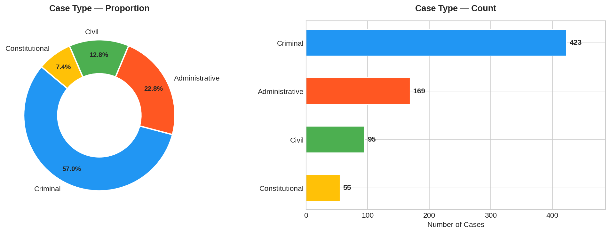
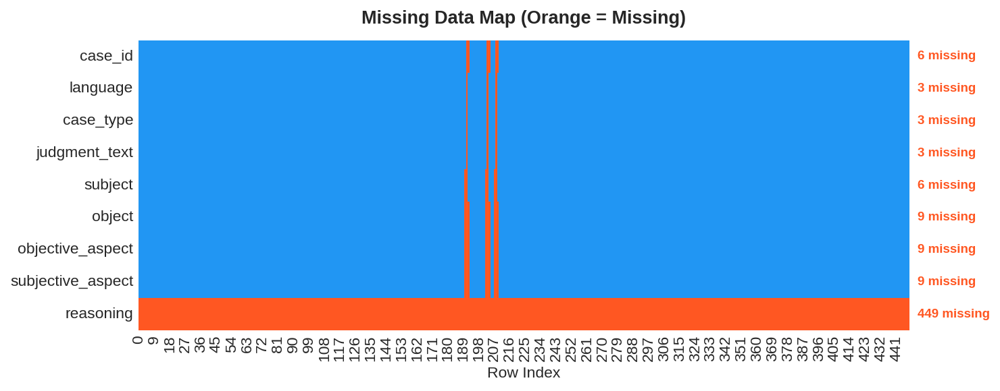
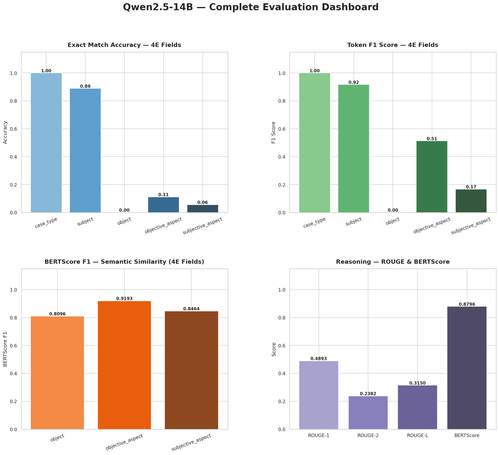
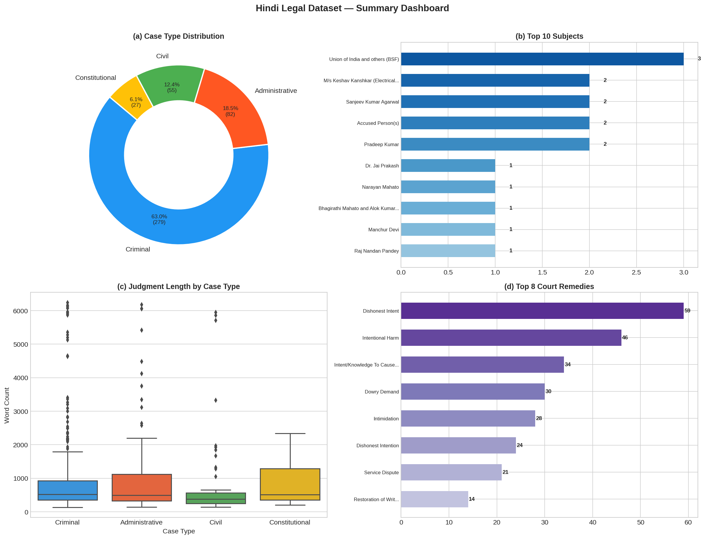
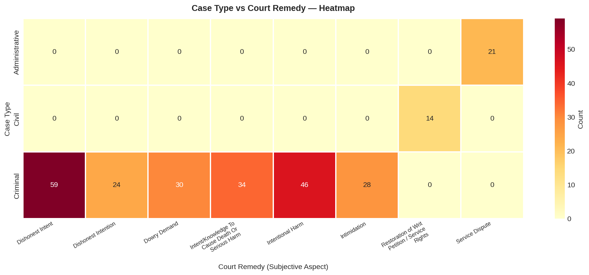

<p align="center">
  
  
  
  
  
</p>

# ⚖️ INDILEX — Indian Legal Event Extraction Dataset & Benchmark

<p align="center">
  <strong>An end-to-end NLP pipeline for extracting structured legal information from Indian High Court judgments using open-source LLMs</strong>
</p>

<p align="center">
  <a href="#-overview">Overview</a> •
  <a href="#-key-highlights">Highlights</a> •
  <a href="#-sample-results">Results</a> •
  <a href="#%EF%B8%8F-pipeline-architecture">Pipeline</a> •
  <a href="#-models--benchmarking">Models</a> •
  <a href="#-getting-started">Setup</a> •
  <a href="#-author">Author</a>
</p>

---

## 📌 Overview

**INDILEX** (Indian Legal Event Extraction) automates the extraction of structured legal information from Indian High Court judgments — a task that is currently manual, expensive, and doesn't scale.

The pipeline processes **762+ raw court judgments** from **7 Indian High Courts** across **3 languages** (Hindi, Assamese, English), and benchmarks **4 open-source LLMs** for structured information extraction using a **4E (Entity-Event-Evidence-Evaluation) Framework**.

> **Why this matters:** India's 25 High Courts produce millions of judgments annually — most in regional languages like Hindi — yet virtually none are structured or machine-readable. INDILEX bridges this gap.

### At a Glance

| Metric | Value |
|--------|-------|
| **Judgments Processed** | 762+ (cleaned & deduplicated) |
| **Source Courts** | 7 Indian High Courts |
| **Languages** | Hindi (primary), Assamese, English |
| **Case Types** | Criminal · Civil · Constitutional · Administrative |
| **Models Benchmarked** | 4 open-source LLMs |
| **Evaluation Metrics** | EM · Token F1 · ROUGE · BERTScore |
| **Annotation Method** | Hybrid (LLM + Human Verification) |

---

## 🎯 Key Highlights

- **🏛️ Multi-court, multilingual** — Processes Hindi, Assamese, and English judgments from Chhattisgarh, Allahabad, Delhi, MP, Jharkhand, Patna, and Gauhati High Courts
- **🔀 Intelligent document routing** — Short documents → direct annotation; long documents (50K+ chars) → three-stage chunk pipeline
- **📋 Case-type-aware prompting** — Specialized templates for Criminal, Civil, Constitutional, and Administrative cases
- **🤖 4-model benchmarking** — Qwen2.5-7B, Qwen2.5-14B, Gemma-2-9B, DeepSeek-R1 evaluated against Claude ground truth
- **⚙️ Production-grade** — Checkpointed batch processing, resume-on-failure, rate limiting, error isolation
- **📊 11 publication-quality visualizations** — Comprehensive dataset analysis and model evaluation dashboards

---

## 📊 Sample Results

### Dataset Composition

<p align="center">
  
</p>

<p align="center"><em>Dataset spans 4 case types across 7 High Courts — Criminal cases dominate at 57%</em></p>

### Data Quality Audit

<p align="center">
  
</p>

<p align="center"><em>Annotation completeness visualization — most fields have >98% coverage</em></p>

### Model Evaluation Dashboard

<p align="center">
  
</p>

<p align="center"><em>Qwen2.5-14B achieves 100% Exact Match on case_type, 0.92 Token F1 on subject, and 0.88 BERTScore on reasoning</em></p>

### Summary Dashboard

<p align="center">
  
</p>

<p align="center"><em>Combined overview: case type distribution, top subjects, judgment lengths, and court remedies</em></p>

### Case Type × Remedy Analysis

<p align="center">
  
</p>

<p align="center"><em>Cross-tabulation reveals Criminal cases dominate across most remedy categories</em></p>

> 📁 **All 11 figures** are available in [`results/figures/`](results/figures/) — see [`results/README.md`](results/README.md) for descriptions.

---

## ⚙️ Pipeline Architecture

```
 Raw Legal Judgment Texts (.txt)
 Chhattisgarh · Allahabad · Delhi · MP · Patna · Jharkhand · Gauhati
                            ↓
            ┌───────────────────────────────────┐
            │   Stage 1: Data Collection        │
            │   Multi-court merging & cleanup   │
            └───────────────┬───────────────────┘
                            ↓
            ┌───────────────────────────────────┐
            │   Stage 2: Metadata Extraction    │
            │   Regex-based structured fields   │
            └───────────────┬───────────────────┘
                            ↓
            ┌───────────────────────────────────┐
            │   Stage 3: Dataset Audit          │
            │   Length distributions, dedup,    │
            │   quality checks, routing split   │
            └───────────────┬───────────────────┘
                            ↓
            ┌───────────────────────────────────┐
            │   Stage 4: Case Routing           │
            │   Short → Direct   Long → Chunk   │
            └──────┬────────────────┬───────────┘
                   ↓                ↓
     ┌──────────────────┐  ┌────────────────────────┐
     │  Direct Annot.   │  │  Chunk Annotation      │
     │  (Groq API)      │  │  (3-stage via vLLM)    │
     │  Single-pass     │  │  Qwen2.5-14B, 2× GPU  │
     └────────┬─────────┘  └──────────┬─────────────┘
              ↓                       ↓
            ┌───────────────────────────────────┐
            │   Human Verification              │
            │   3 annotators × 4 case types     │
            └───────────────┬───────────────────┘
                            ↓
            ┌───────────────────────────────────┐
            │   LLM Extraction (4E Framework)   │
            │   Qwen · Gemma · DeepSeek         │
            └───────────────┬───────────────────┘
                            ↓
            ┌───────────────────────────────────┐
            │   Multi-Metric Evaluation         │
            │   EM · F1 · ROUGE · BERTScore     │
            │   vs. Claude Ground Truth         │
            └───────────────┬───────────────────┘
                            ↓
            ┌───────────────────────────────────┐
            │   Visualization & Analysis        │
            │   11 publication-quality figures   │
            └───────────────────────────────────┘
```

> 📖 **Full technical documentation:** [`docs/pipeline.md`](docs/pipeline.md)

---

## 🤖 Models & Benchmarking

### Models Evaluated

| Model | Parameters | Provider | GPU Memory | Key Strength |
|-------|-----------|----------|------------|--------------|
| **Qwen2.5-7B-Instruct** | 7B | Alibaba | ~14 GB (fp16) | Strong Hindi understanding |
| **Qwen2.5-14B-Instruct** | 14B | Alibaba | ~28 GB (2× GPU) | Best overall quality |
| **Gemma-2-9B-IT** | 9B | Google | ~18 GB (fp16) | Different architecture perspective |
| **DeepSeek-R1-Distill-Qwen-7B** | 7B | DeepSeek | ~14 GB (fp16) | Enhanced reasoning |

**Ground Truth**: Claude (Anthropic) annotations serve as the gold-standard reference.

### Evaluation Metrics

| Metric | Scope | What It Measures |
|--------|-------|-----------------|
| **Exact Match (EM)** | `case_type` | Binary correctness for categorical fields |
| **Token F1** | All text fields | Token-level precision/recall overlap |
| **ROUGE-1/2/L** | `reasoning` | N-gram overlap for reasoning quality |
| **BERTScore** | `reasoning` | Semantic similarity via contextual embeddings |

### Sample Results (Qwen2.5-14B)

| Field | Exact Match | Token F1 | BERTScore |
|-------|:-----------:|:--------:|:---------:|
| `case_type` | **1.00** | **1.00** | — |
| `subject` | **0.89** | **0.92** | — |
| `objective_aspect` | 0.11 | 0.51 | **0.92** |
| `subjective_aspect` | 0.06 | 0.17 | **0.85** |
| `reasoning` (ROUGE-L) | — | — | **0.88** |

> 📓 **Full evaluation notebooks:** [`notebooks/experiments/evaluation/`](notebooks/experiments/evaluation/)

---

## 📦 Annotation Schema (4E Framework)

Each judgment is annotated with structured fields following the **Entity-Event-Evidence-Evaluation** framework:

| Field | Description | Example |
|-------|-------------|---------|
| `case_type` | Criminal / Civil / Constitutional / Administrative | `Criminal` |
| `subject` | Primary legal subject / petitioner's claim | `Appellant challenging conviction under IPC Section 302` |
| `object` | Object of the legal action | `Murder conviction and life imprisonment` |
| `objective_aspect` | Factual/objective elements | `FIR filed, witnesses examined, forensic evidence` |
| `subjective_aspect` | Interpretive elements & judicial reasoning | `Court found prosecution's evidence credible` |
| `legal_provision` | Acts, Articles, Sections cited | `IPC Section 302, CrPC Section 374` |
| `reasoning` | Court's rationale for the decision | `Upheld conviction based on eyewitness testimony...` |

---

## 📁 Repository Structure

```
INDILEX/
├── README.md                              # This file
├── LICENSE                                # MIT License
├── requirements.txt                       # Python dependencies
├── .gitignore                             # Git exclusions (data files excluded)
│
├── notebooks/                             # 📓 Organized Jupyter notebooks
│   ├── 01_data_collection_pipeline.ipynb  # Raw .txt → initial annotation Excel
│   ├── 02_judgment_metadata_extraction.ipynb  # Structured metadata extraction
│   ├── 03_dataset_audit.ipynb             # Length audit, routing estimates
│   ├── 04_batch_annotation.ipynb          # Groq API batch annotation
│   ├── 05_long_document_annotation.ipynb  # 3-stage chunk annotation (vLLM)
│   ├── 06_hindi_annotation_pipeline.ipynb # Claude API Hindi annotation fill
│   ├── 07_model_selection.ipynb           # Model comparison & selection
│   ├── 08_dataset_visualization.ipynb     # 11 publication-quality figures
│   ├── 09_routing_analysis.ipynb          # Direct vs Chunk visualization
│   └── experiments/
│       ├── extraction/                    # Per-model extraction runs
│       │   ├── qwen2.5_7b_extraction.ipynb
│       │   ├── qwen2.5_14b_extraction.ipynb
│       │   ├── deepseek_r1_extraction.ipynb
│       │   └── gemma2_9b_extraction.ipynb
│       └── evaluation/                    # Per-model evaluation
│           ├── qwen2.5_7b_evaluation.ipynb
│           ├── qwen2.5_14b_evaluation.ipynb
│           ├── deepseek_r1_evaluation.ipynb
│           └── gemma2_9b_evaluation.ipynb
│
├── data/
│   ├── sample/                            # Small sample for demos
│   │   └── enriched_legal_records.xlsx    # Claude ground truth (4 cases)
│   └── README.md                          # Dataset documentation & download guide
│
├── results/
│   ├── figures/                           # 📊 11 publication-quality PNG figures
│   ├── model_outputs/                     # Per-model extraction XLSX files
│   ├── audit_reports/                     # 15 data quality audit CSVs
│   ├── evaluation_dashboard_for10_sample.png
│   └── README.md                          # Results documentation
│
└── docs/
    ├── pipeline.md                        # Full technical pipeline documentation
    ├── dataset.md                         # Dataset card (HuggingFace format)
    └── interview_notes.md                 # Interview preparation guide
```

---

## 🚀 Getting Started

### Prerequisites

- Python 3.10+
- NVIDIA GPU with ≥24 GB VRAM for extraction experiments (e.g., RTX 3090)
- 2× GPUs for Qwen2.5-14B (tensor parallel via vLLM)
- CPU-only is sufficient for evaluation and visualization notebooks

### Installation

```bash
# Clone the repository
git clone https://github.com/aniket821108/Indilex.git
cd Indilex

# Create virtual environment
python -m venv venv
source venv/bin/activate      # Linux/Mac
# venv\Scripts\activate       # Windows

# Install dependencies
pip install -r requirements.txt
```

### Download Dataset

Large datasets (>50 MB) are hosted separately. See [`data/README.md`](data/README.md) for full instructions.

```python
from huggingface_hub import snapshot_download

snapshot_download(
    repo_id="<your-username>/INDILEX-dataset",  # Coming soon
    repo_type="dataset",
    local_dir="data/"
)
```

> ⏳ **HuggingFace dataset upload coming soon** — see [`docs/dataset.md`](docs/dataset.md) for the dataset card.

### Quick Demo

```python
import pandas as pd

# Load Claude ground truth sample (included in repo)
gt = pd.read_excel("data/sample/enriched_legal_records.xlsx")
print(gt[["case_id", "case_type", "subject"]].head())

# Load a model's extraction output
qwen = pd.read_excel("results/model_outputs/indilex_extracted_output_Qwen.xlsx")
print(qwen[["case_id", "case_type", "subject"]].head())
```

### Run the Full Pipeline

```bash
# Step 1 → Data Collection
jupyter notebook notebooks/01_data_collection_pipeline.ipynb

# Step 2 → Dataset Audit & Routing
jupyter notebook notebooks/03_dataset_audit.ipynb

# Step 3 → Batch Annotation (requires Groq API key)
jupyter notebook notebooks/04_batch_annotation.ipynb

# Step 4 → LLM Extraction (requires GPU)
jupyter notebook notebooks/experiments/extraction/qwen2.5_7b_extraction.ipynb

# Step 5 → Evaluate Against Ground Truth
jupyter notebook notebooks/experiments/evaluation/qwen2.5_7b_evaluation.ipynb

# Step 6 → Generate Visualizations
jupyter notebook notebooks/08_dataset_visualization.ipynb
```

---

## 🔧 Technical Challenges & Solutions

| Challenge | Solution | Impact |
|-----------|----------|--------|
| Judgments exceeding LLM context windows (50K+ chars) | Three-stage chunk pipeline with cross-chunk aggregation | Zero information loss from long documents |
| LLMs producing malformed JSON responses | Regex-based extraction, retry logic, fallback parsing | ~95% first-attempt success rate |
| 6 courts with different data formats | Unified schema merger with per-court adapters | Single consistent dataset from heterogeneous sources |
| Hindi/Devanagari text processing | Adapted tokenization and length estimation for Hindi | Accurate routing and token-aware chunking |
| GPU memory for 14B model | Tensor-parallel via vLLM across 2× RTX 3090 | Full-speed inference on consumer GPUs |
| Production reliability for batch annotation | Checkpoint + resume system with error isolation | Hours-long annotation jobs survive interruptions |

---

## ⚠️ Limitations

- **Small evaluation set** — Model evaluation uses a limited number of Claude-annotated ground-truth cases
- **Language coverage** — Primary focus is Hindi; Assamese and English support is partial
- **Zero-shot only** — All models used without task-specific fine-tuning
- **Context window constraints** — Long judgments require chunking, which may lose some cross-section context
- **Ground truth dependency** — Evaluation relies on Claude as reference, which itself may contain errors

## 🔮 Future Work

- **Fine-tune** Qwen2.5-7B on INDILEX annotations (expected 15–25% improvement)
- **Build RAG pipeline** for legal question answering over structured data
- **Scale to 5,000+ judgments** across all 25 Indian High Courts + Supreme Court
- **Add more languages** — Bengali, Tamil, Telugu, Marathi
- **Cross-document analysis** — Citation networks, precedent tracking, temporal analysis
- **Inter-annotator agreement** — Formal IAA metrics (Cohen's κ, Fleiss' κ)
- **Automated CI/CD benchmarking** — Re-evaluate when new models are released

---

## 📝 Citation

If you use INDILEX in your research, please cite:

```bibtex
@misc{indilex2026,
  title   = {INDILEX: Indian Legal Event Extraction Dataset and Benchmark},
  author  = {Aniket Kumar},
  year    = {2026},
  note    = {Research internship at IIT Patna},
  url     = {https://github.com/aniket821108/Indilex}
}
```

## 📄 License

This project is licensed under the [MIT License](LICENSE).

---

## 👤 Author

**Aniket Kumar**
- 🎓 B.Tech, 4th Year (7th Semester) — NIT Mizoram
- 🔬 Research Intern — Indian Institute of Technology, Patna
- 🐙 GitHub: [aniket821108](https://github.com/aniket821108)
- 💼 LinkedIn: [Aniket Kumar](https://www.linkedin.com/in/aniket-kumar-1225a7284/)

---

<p align="center">
  <strong>Built with ❤️ during a research internship at IIT Patna, 2026</strong>
</p>

<p align="center">
  <sub>⭐ Star this repo if you find it useful!</sub>
</p>
